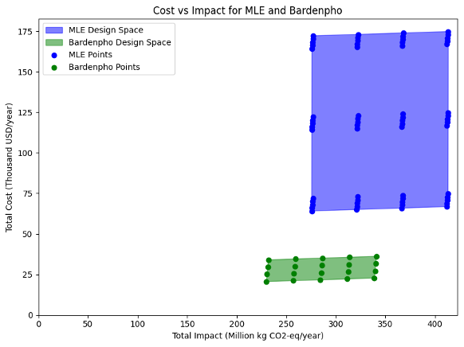
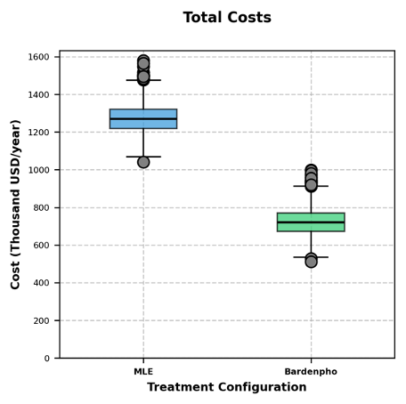
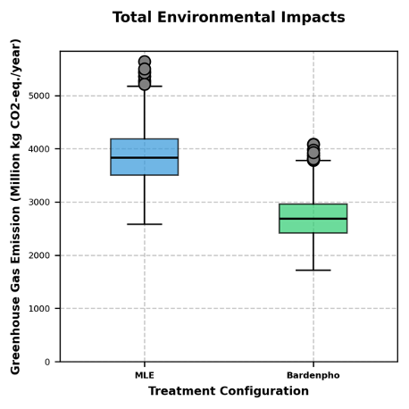
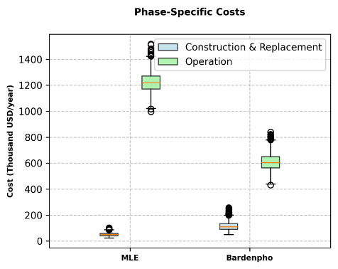
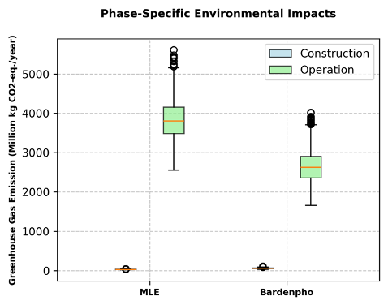
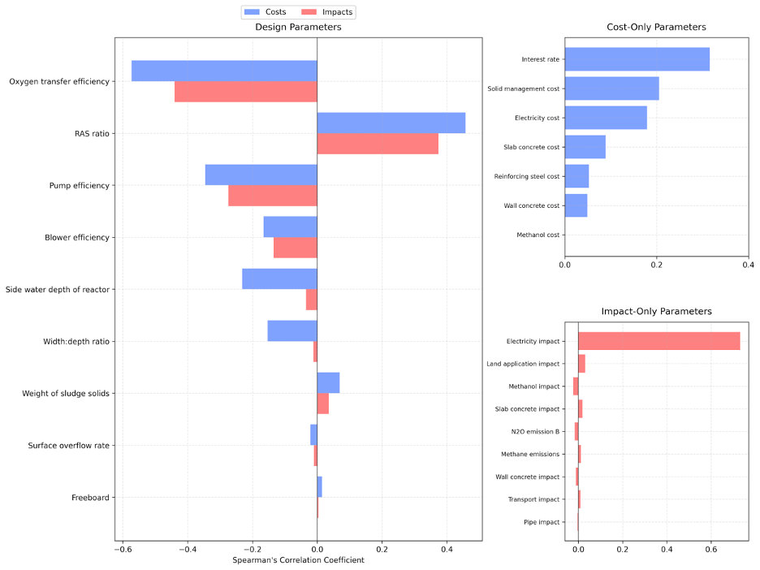

# Wastewater Treatment Uncertainty & Sensitivity Analysis

This repository contains Python scripts and the final report supporting:

> **“Sustainability Analysis of Two BNR Configurations to Mitigate Algae Blooms in San Francisco Bay.”**  
> BlueStream Innovations (Nehal Jain, Buai Shi, Nina Trousdale, Linshui Zhang, Tejashree Babar, Sristi Shreya).  
> December 20, 2024.

---

## Executive Summary

The San Francisco Bay area faces increasing algae blooms due to ... evaluated two biological nitrogen removal (BNR) configurations:  
- Modified Ludzak-Ettinger (MLE) Process with a denitrification filter, and  
- 4-stage Bardenpho Process.  

The study utilized GPS-X, a wastewater modeling and simulation s...is to identify key drivers of cost and greenhouse gas emissions.  
The 4-stage Bardenpho process emerged as the optimal solution wi...t require any methanol addition as well, unlike the MLE process.  
The recommended design is a Bardenpho configuration with a disso... constraint on the total nitrogen concentration in the effluent.

---

## Results at a Glance

### 1. Cost vs. Environmental Impact  

Below is a scatter plot comparing annual cost (USD/year) on the _y‐axis_ against GHG impact (t CO₂‐eq / yr) on the _x‐axis_ for each simulated design.  

<small>**Figure 2.** Annual cost and GHG impact for MLE (red) vs. Bardenpho (blue) designs. The bottom‐left region is “lower cost + lower impact.”</small>

---

### 2. Uncertainty Analysis  

We performed 5,000 Monte Carlo iterations on the **optimal** Bardenpho design (DO = 0.5 mg/L, SRT = 31.4 days) and the best MLE design (DO = 0.5 mg/L, SRT = 20.3 days, Methanol = 5 m³/d). The boxplots below show the resulting distributions:

  

    
     <small>Figure 3(a). Annual cost uncertainty.</small>
  

  

    
     <small>Figure 3(b). GHG impact uncertainty.</small>
  

---

### 3. Phase‐Specific Cost & Impact Breakdown  

For the **optimal Bardenpho design**, construction costs and O&M costs break down as follows:

  

    
     <small>Figure 4(a). Construction vs. O&M cost shares.</small>
  

  

    
     <small>Figure 4(b). Construction vs. O&M GHG impacts.</small>
  

---

### 4. Sensitivity Analysis (Spearman’s ρ)

Among ~30 uncertain parameters, the following had the largest effect (highest absolute Spearman rank‐correlation coefficients) on cost/impact:

<small>**Figure 5.** Sensitivity ranking of key parameters for Bardenpho (top contributors to cost & impact uncertainty).</small>

---

## How to Reproduce These Plots

1. Run the Python scripts in order:
   - `cee493.py`  
   - `cee493_uncertainty.py`  
   - `sensitivity.py`  
2. Each script generates the corresponding PNG files used above (e.g., `figure2_cost_vs_impact.png`, `figure3_uncertainty_cost.png`, etc.).  
3. Ensure you have the required Python packages installed (e.g., `pandas`, `numpy`, `matplotlib`, `pyomo`, `gnupcarbon`, etc.)  

---

## Files in This Repository

- **cee493.py** – Main simulation & TEA/LCA driver.  
- **cee493_uncertainty.py** – Monte Carlo uncertainty analysis.  
- **sensitivity.py** – Spearman’s rank sensitivity analysis.  
- **Final Report.docx** – Detailed write‐up, simulation methodology, and appendices.  
- **figure2_cost_vs_impact.png** – Cost vs. impact scatter plot.  
- **figure3_uncertainty_cost.png**, **figure3_uncertainty_impact.png** – Uncertainty analysis boxplots.  
- **figure4_phase_cost.png**, **figure4_phase_impact.png** – Phase‐specific cost and impact charts.  
- **figure5_sensitivity.png** – Sensitivity analysis bar chart.  
- **README.md** – This file.  
- **.gitignore** – Excludes caches and checkpoints.  

---

## Author & Acknowledgments

**BlueStream Innovations Team:**  
Nehal Jain · Buai Shi · Nina Trousdale · Linshui Zhang · Tejashree Babar · **Sristi Shreya**  

December 20, 2024  

---

## License

MIT © 2024 Sristi Shreya  
